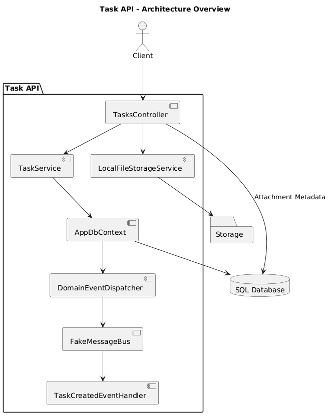
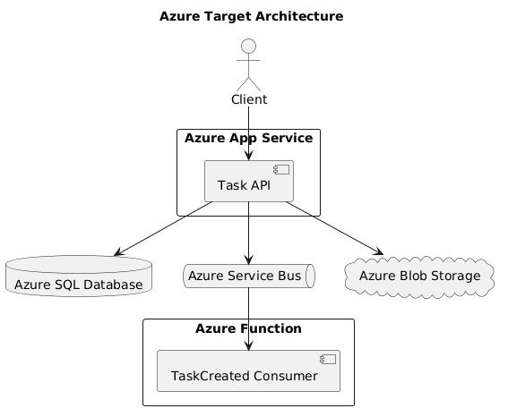

# Task API (AZ-204 Cloud Architecture Practice Project)

This project is a cloud-native backend application built with **.NET 8** and inspired by **Microsoft Azure** architecture patterns.

It was created as a practical learning project to gain hands-on experience with distributed systems, event-driven architecture, messaging, storage abstractions, monitoring, and secure configuration while preparing for the **Microsoft Azure Developer Associate (AZ-204)** certification.

The project focuses on understanding the architectural principles behind modern cloud applications rather than relying on Azure portal configuration alone.

---

# Purpose

The goals of this project are:

* Gain practical experience with cloud-native backend architecture
* Learn Azure-related design patterns through implementation
* Build a scalable and loosely coupled backend system
* Apply event-driven and asynchronous processing concepts
* Practice monitoring, security, and storage abstractions
* Prepare for the AZ-204 certification through project-based learning

---

# Architecture Overview

The application follows a modular and event-driven architecture inspired by Azure services and distributed system patterns.

## Current Architecture



### Implemented Components

* ASP.NET Core Web API
* Entity Framework Core
* SQL Server LocalDB
* Domain Events
* Integration Events
* Message Bus Abstraction
* Consumer Pipeline
* Dependency Injection Scopes
* File Storage Abstraction
* Attachment Metadata Persistence
* Structured Logging (ILogger)
* Secure Configuration via User Secrets

---

## Azure Target Architecture



The project architecture is intentionally designed so that local implementations can later be replaced with Azure services with minimal architectural changes.

| Local Implementation    | Azure Equivalent     |
| ----------------------- | -------------------- |
| ASP.NET Core API        | Azure App Service    |
| SQL Server LocalDB      | Azure SQL Database   |
| FakeMessageBus          | Azure Service Bus    |
| Consumer Handlers       | Azure Functions      |
| LocalFileStorageService | Azure Blob Storage   |
| User Secrets            | Azure Key Vault      |
| ILogger                 | Application Insights |

---

# Local Development Configuration

The database connection string is configured using .NET User Secrets and is intentionally not stored in the repository.

Initialize User Secrets:

```bash
dotnet user-secrets init
```

Configure the connection string:

```bash
dotnet user-secrets set "ConnectionStrings:DefaultConnection" "<connection-string>"
```

Verify configured secrets:

```bash
dotnet user-secrets list
```

---

# Key Features

* CRUD operations for task management
* Domain event creation and dispatching
* Integration event mapping
* Event-driven architecture
* Consumer-based asynchronous processing
* Message bus abstraction layer
* File upload and attachment handling
* Blob storage abstraction
* Attachment metadata persistence
* Structured logging with ILogger
* Environment-specific configuration
* Secure configuration using User Secrets
* Clean separation of concerns

---

# Event Flow

```text
Client Request
    ↓
Task API
    ↓
Domain Event Created
    ↓
DbContext Dispatching
    ↓
Integration Event Mapping
    ↓
Message Bus Publishing
    ↓
Consumer Processing
```

---

# Storage Flow

```text
File Upload
    ↓
Storage Service
    ↓
Local Storage (Blob Simulation)

Attachment Metadata
    ↓
SQL Database
```

---

# AZ-204 Topics Covered

This project maps directly to several core AZ-204 certification areas.

## Develop Azure Compute Solutions

Implemented:

* ASP.NET Core Web API
* Dependency Injection
* Service-based architecture
* Asynchronous processing
* Azure Functions architectural concepts

Why it matters:

AZ-204 focuses heavily on designing and implementing scalable compute solutions using App Services, Functions, and dependency injection patterns.

---

## Develop for Azure Storage

Implemented:

* Entity Framework Core
* SQL persistence
* File storage abstraction
* Attachment metadata persistence
* Blob storage concepts

Why it matters:

Understanding when to use relational storage versus object storage is a fundamental Azure development skill.

---

## Implement Azure Security

Implemented:

* User Secrets
* IConfiguration-based configuration
* Environment-specific configuration
* Secure configuration management

Prepared for:

* Azure Key Vault
* Managed Identity

Why it matters:

AZ-204 expects developers to understand secure secret handling and cloud-native configuration management.

---

## Connect to and Consume Azure Services

Implemented:

* Domain Events
* Integration Events
* Message Bus abstraction
* Consumer architecture
* Event-driven communication

Prepared for:

* Azure Service Bus
* Event-driven cloud architectures

Why it matters:

Messaging and asynchronous communication are core topics throughout the AZ-204 exam.

---

## Monitor and Troubleshoot Azure Solutions

Implemented:

* Structured logging with ILogger
* Log levels
* Event tracing concepts
* Environment-specific logging configuration

Prepared for:

* Application Insights
* Azure Monitor

Why it matters:

Modern cloud applications must be observable, diagnosable, and monitorable in production environments.

---

# Technical Concepts Demonstrated

The project currently demonstrates:

* Domain Event Pattern
* Integration Event Pattern
* Event-driven Architecture
* Consumer Pipeline Pattern
* Dependency Injection
* Scoped Service Resolution
* Asynchronous Event Processing
* Storage Abstraction
* Secure Configuration Management
* Structured Logging
* Separation of Domain and Integration Concerns

---

# Azure Simulation Notes

Because the project was intentionally developed without requiring an active Azure subscription, several Azure services are currently represented by local implementations and abstractions.

Examples:

* Azure Service Bus → FakeMessageBus
* Azure Functions → Consumer Handlers
* Azure SQL Database → SQL Server LocalDB
* Azure Blob Storage → LocalFileStorageService
* Azure Key Vault → User Secrets

The architecture was designed so that these local implementations can later be replaced with real Azure services with minimal changes to the application code.

---

# Project Status

Core functionality has been implemented and the project is actively used as a practical learning platform for cloud architecture and AZ-204 preparation.

Future enhancements may include integration with real Azure services such as:

* Azure Service Bus
* Azure Functions
* Azure Blob Storage
* Azure SQL Database
* Application Insights

---

# Notes

This project is intentionally designed to balance:

* practical backend engineering
* cloud-native architecture concepts
* Azure certification preparation
* portfolio relevance
* real-world software design patterns

The primary goal is not only to learn Azure services themselves, but to understand the architectural principles behind modern distributed cloud applications.
